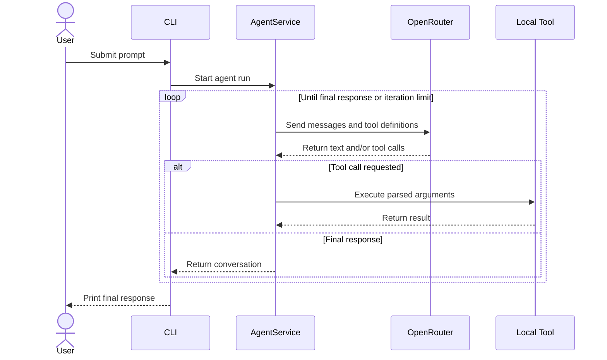

# Harness OpenRouter

A small, extensible coding-agent harness built with TypeScript, Bun, and the
OpenRouter Chat Completions API.

The project implements an agent loop that sends a prompt to an OpenRouter
model, exposes local tools through function calling, executes requested tools,
and returns their results to the model until it produces a final response.

> [!WARNING]
> This project gives the selected model access to tools that can read and
> overwrite files and execute Bash commands with the permissions of the current
> user. Run it only in a trusted, isolated directory and review prompts before
> execution.

## Features

- OpenRouter-compatible model access
- Iterative tool-calling agent loop
- Configurable model, system prompt, API base URL, and iteration limit
- Dependency inversion through domain interfaces
- Extensible tool registry
- Built-in tools for:
  - listing directories;
  - reading UTF-8 files;
  - creating, overwriting, and appending to files;
  - executing Bash commands with a timeout.

## How It Works



## Requirements

- [Bun](https://bun.sh/) installed
- An [OpenRouter](https://openrouter.ai/) API key
- A model on OpenRouter that supports tool calling

## Quick Start

1. Clone the repository and enter its directory:

   ```bash
   git clone https://github.com/williamkoller/harness-openrouter.git
   cd harness-openrouter
   ```

2. Install dependencies:

   ```bash
   bun install
   ```

3. Create the local environment file:

   ```bash
   cp .env.example .env
   ```

4. Set your OpenRouter API key in `.env`:

   ```dotenv
   OPENROUTER_API_KEY=sk-or-v1-your-key
   ```

5. Run the agent:

   ```bash
   bun start "Inspect this project and explain its architecture"
   ```

## Configuration

Bun loads `.env` automatically when the application starts.

| Variable | Required | Default | Description |
| --- | --- | --- | --- |
| `OPENROUTER_API_KEY` | Yes | — | OpenRouter API key. |
| `OPENROUTER_MODEL` | No | `deepseek/deepseek-chat` | OpenRouter model identifier. |
| `AGENT_SYSTEM_PROMPT` | No | Built-in concise coding-agent prompt | Instructions applied to every run. |
| `MAX_ITERATIONS` | No | `12` | Maximum number of model/tool iterations. |
| `OPENROUTER_BASE_URL` | No | `https://openrouter.ai/api/v1` | OpenRouter-compatible API base URL. |

Never commit `.env` or expose your API key in prompts, logs, or command output.

## Usage

Pass the complete task as CLI arguments:

```bash
bun start "List the files in the current directory"
bun start "Read package.json and summarize the available scripts"
bun start "Create a file named notes.txt containing a project summary"
```

During execution, the CLI prints the selected model, each agent iteration,
assistant messages, requested tool calls, abbreviated tool results, and the
final response.

For development with automatic restart:

```bash
bun run dev -- "Inspect src and identify the main components"
```

## Built-in Tools

| Tool | Capability | Relevant behavior |
| --- | --- | --- |
| `read_dir` | Lists directory entries | Resolves paths from the process working directory. |
| `read_file` | Reads UTF-8 files | Truncates output after approximately 200 KB. |
| `write_file` | Writes or appends text | Creates parent directories and can overwrite existing files. |
| `execute_bash` | Runs `bash -c` commands | Uses a 30-second timeout by default and returns stdout, stderr, and exit code. |

Tools currently resolve arbitrary local paths and are not sandboxed by the
application. The shell tool also inherits the parent process environment.

## Architecture

The code follows a lightweight Clean Architecture approach:

```text
src/
├── domain/
│   ├── entities/        # Conversation message types
│   ├── repositories/    # LLM abstraction
│   ├── services/        # Agent orchestration and tool registry
│   └── tools/           # Tool contract
├── infrastructure/
│   ├── config/          # Environment configuration
│   ├── llm/             # OpenRouter adapter
│   └── tools/           # Local tool implementations
└── index.ts             # Composition root and CLI entrypoint
```

The domain layer depends on interfaces rather than OpenRouter or filesystem
implementations. `src/index.ts` acts as the composition root, wiring the
repository, registry, tools, and agent service together.

## Extending the Harness

To add a tool:

1. Implement the `Tool` interface from `src/domain/tools/tool.ts`.
2. Define a unique name, description, JSON Schema parameters, and `execute`
   method.
3. Register the implementation in `buildTools()` in `src/index.ts`.

To support another model provider, implement the `LLMRepository` interface and
inject the adapter when constructing `AgentService`.

## Development

Start the application:

```bash
bun run start -- "Your prompt"
```

Run it in watch mode:

```bash
bun run dev -- "Your prompt"
```

Check the TypeScript types:

```bash
bunx tsc --noEmit
```

## Current Limitations

- Runs one CLI prompt per process; conversation history is not persisted.
- Tool execution has no application-level sandbox or approval step.
- HTTP requests do not currently define an explicit timeout or retry policy.
- The repository does not yet include automated tests.

## License

No license has been specified. Unless a license is added, the source code
remains under the default copyright restrictions.
