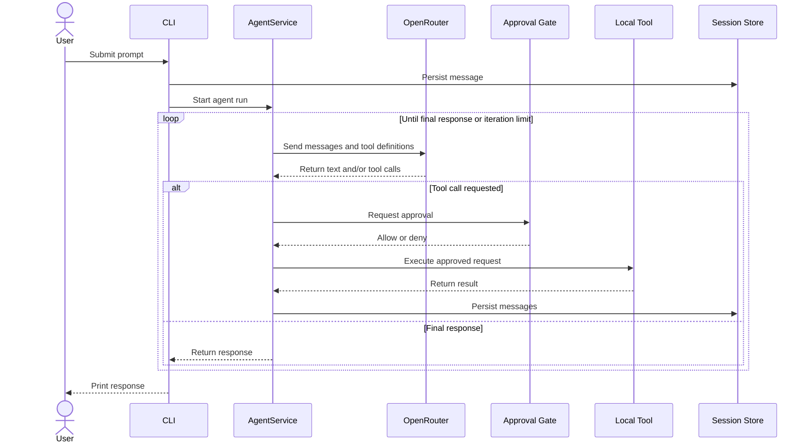

# Harness OpenRouter

A small, extensible coding-agent CLI built with TypeScript, Bun, and the
OpenRouter Chat Completions API.

The harness supports interactive and one-shot prompts, local tool calling,
approval policies, persisted sessions, configurable reasoning effort, and
resilient HTTP requests.

> [!WARNING]
> The selected model can request tools that read and overwrite files or execute
> Bash commands with the permissions of the current user. Use the `ask` or
> `read-only` approval mode, run the harness in a trusted directory, and inspect
> tool requests before approving them.

## Features

- Interactive REPL and one-shot execution
- OpenRouter-compatible model access
- Iterative tool-calling agent loop
- Configurable model and reasoning effort
- Approval policies for read, write, and command execution
- JSONL session persistence and session resumption
- HTTP timeout, retry, exponential backoff, and `Retry-After` support
- Extensible tool registry and dependency-inverted domain interfaces
- Automated tests and strict TypeScript checking

## Requirements

- [Bun](https://bun.sh/)
- An [OpenRouter](https://openrouter.ai/) API key
- An OpenRouter model that supports tool calling

## Quick Start

```bash
git clone https://github.com/williamkoller/harness-openrouter.git
cd harness-openrouter
bun install
cp .env.example .env
```

Set your API key in `.env`:

```dotenv
OPENROUTER_API_KEY=sk-or-v1-your-key
```

Start the interactive REPL:

```bash
bun run start
```

Run one prompt and exit:

```bash
bun run start -- -p "Inspect this project and explain its architecture"
```

## CLI Usage

```text
bun run start
bun run start -- -p "<prompt>"
bun run start -- --resume <session-id>
```

Available flags:

- `-p, --print <prompt>`: run one prompt and exit.
- `-m, --model <provider/model>`: override `OPENROUTER_MODEL`.
- `-r, --reasoning <level>`: use `off`, `low`, `medium`, or `high`.
- `-a, --approval <mode>`: use `auto`, `ask`, `read-only`, or `deny-write`.
- `--resume <id>`: load a persisted session.
- `-h, --help`: show CLI help.

Positional arguments are also treated as a one-shot prompt:

```bash
bun run start -- "List the files in the current directory"
```

### REPL Commands

- `/help` or `/?`: list commands.
- `/model [provider/model]`: show or change the model.
- `/reasoning [level]`: show or change reasoning effort.
- `/approval [mode]`: show or change the approval mode.
- `/tools`: list registered tools.
- `/history`: show message counts by role.
- `/session`: show the session ID and file path.
- `/clear`: clear the current persisted history.
- `/exit`, `/quit`, or `/q`: exit the REPL.

## Approval Modes

- `auto`: allow every tool request without prompting.
- `ask`: allow read operations and request confirmation for writes and command
  execution.
- `read-only`: allow reads and deny writes and command execution.
- `deny-write`: allow reads and request confirmation for non-read operations.

Approvals can be granted once, for the current session, or denied through the
interactive prompt.

## Configuration

Bun loads `.env` automatically:

- `OPENROUTER_API_KEY` is required.
- `OPENROUTER_MODEL` defaults to `deepseek/deepseek-chat`.
- `OPENROUTER_BASE_URL` defaults to `https://openrouter.ai/api/v1`.
- `AGENT_SYSTEM_PROMPT` defaults to the built-in concise coding-agent prompt.
- `MAX_ITERATIONS` defaults to `12`.
- `AGENT_REASONING` defaults to `medium`.
- `SANDBOX_MODE` defaults to `ask`.
- `HTTP_TIMEOUT_MS` defaults to `60000`.
- `HTTP_MAX_RETRIES` defaults to `3`.
- `HARNESS_SESSION_DIR` defaults to `.harness/sessions`.

Never commit `.env` or expose the API key in prompts, logs, session files, or
command output.

## Sessions

Messages are appended as JSONL records under `.harness/sessions` by default.
Each run receives a generated session ID. Use `/session` to inspect the active
session and resume it later:

```bash
bun run start -- --resume 20260915-152257-di9uko
```

Set `HARNESS_SESSION_DIR` to store sessions elsewhere. Malformed JSONL records
are skipped when a session is loaded.

## Built-in Tools

- `read_dir`: lists directory entries.
- `read_file`: reads UTF-8 files and truncates output at approximately 200 KB.
- `write_file`: creates, overwrites, or appends text and creates parent
  directories.
- `execute_bash`: runs `bash -c`, defaults to a 30-second timeout, and truncates
  stdout and stderr at approximately 100 KB each.

File tools resolve local paths, and command execution inherits the parent
process environment. Approval policies control whether a request is allowed;
they do not provide operating-system-level isolation.

## How It Works



## Architecture

The project follows a lightweight Clean Architecture approach:

```text
src/
├── cli/                  # Arguments, REPL, rendering, and session state
├── domain/
│   ├── approval/         # Approval contracts
│   ├── entities/         # Conversation messages
│   ├── repositories/     # LLM and session-store interfaces
│   ├── services/         # Agent orchestration and tool registry
│   └── tools/            # Tool contract
├── infrastructure/
│   ├── approval/         # Policies and approval gate
│   ├── config/           # Environment configuration
│   ├── http/             # Timeout and retry support
│   ├── llm/              # OpenRouter adapter
│   ├── persistence/      # JSONL session store
│   └── tools/            # Local tool implementations
└── index.ts              # Composition root
```

The domain layer depends on interfaces rather than OpenRouter, the filesystem,
or terminal implementations. `src/index.ts` wires the concrete adapters at the
application boundary.

## Extending the Harness

To add a tool:

1. Implement `Tool` from `src/domain/tools/tool.ts`.
2. Define its name, category, description, JSON Schema parameters, and
   `execute` method.
3. Register it in `buildTools()` in `src/index.ts`.

To support another model provider, implement `LLMRepository` and inject the
adapter when constructing `AgentService`.

To support another session backend, implement `SessionStore` and inject it into
`SessionState`.

## Development

```bash
# Watch mode
bun run dev

# Run all tests
bun test

# Check application and test types
bun run typecheck
bun run typecheck:tests
```

## Security Notes

- Prefer `ask` unless fully automatic local execution is intentional.
- Use `read-only` when the agent only needs repository inspection.
- Review commands and paths before approving tool execution.
- Run untrusted tasks in a disposable container or virtual machine.
- Treat persisted sessions as sensitive because they may contain prompts,
  model responses, tool arguments, and tool output.

## License

No license has been specified. Unless a license is added, the source code
remains under the default copyright restrictions.
