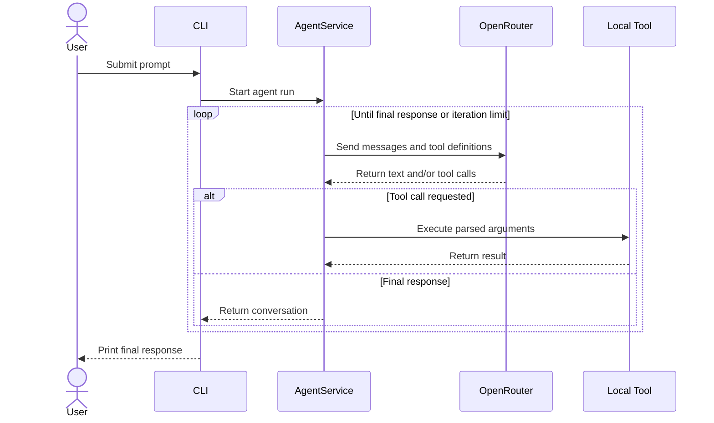

# Harness OpenRouter — Project Summary

## Overview

**Harness OpenRouter** is a lightweight, extensible coding-agent harness built with **TypeScript**, **Bun**, and the **OpenRouter Chat Completions API**. It implements an iterative agent loop that sends a prompt to an OpenRouter model, exposes local tools through function calling, executes requested tools, and returns their results to the model until it produces a final response.

---

## Architecture (Clean Architecture)

```
src/
├── index.ts                  # Composition root & CLI entrypoint
├── domain/
│   ├── entities/             # Conversation message types (Message.ts, ToolCall.ts)
│   ├── repositories/         # LLMRepository interface (LLM abstraction)
│   ├── services/             # AgentService (orchestration), ToolRegistry
│   └── tools/                # Tool contract interface
├── infrastructure/
│   ├── config/               # Environment configuration via env.ts
│   ├── llm/                  # OpenRouterLLMRepository adapter
│   └── tools/                # Concrete tool implementations:
│       ├── ReadDirTool.ts
│       ├── ReadFileTool.ts
│       ├── WriteFileTool.ts
│       └── ExecuteBashTool.ts
```

The domain layer depends **only on interfaces**, not on OpenRouter or filesystem implementations. `src/index.ts` wires everything together at the composition root.

---

## How It Works



---

## Built-in Tools

| Tool | Capability | Notes |
| --- | --- | --- |
| `read_dir` | List directory entries | Resolves from CWD. |
| `read_file` | Read UTF-8 files (≤200 KB) | Truncates output. |
| `write_file` | Write/append text files | Creates parent dirs; can overwrite. |
| `execute_bash` | Run shell commands | 30s timeout; inherits env. |

⚠️ **No sandbox** — tools run with the user's file and shell permissions.

---

## Configuration (via `.env`)

| Variable | Required | Default | Description |
| --- | --- | --- | --- |
| `OPENROUTER_API_KEY` | ✅ Yes | — | OpenRouter API key |
| `OPENROUTER_MODEL` | ❌ No | `deepseek/deepseek-chat` | Model identifier |
| `AGENT_SYSTEM_PROMPT` | ❌ No | Built-in prompt | System prompt text |
| `MAX_ITERATIONS` | ❌ No | `12` | Max tool-call loops |
| `OPENROUTER_BASE_URL` | ❌ No | `https://openrouter.ai/api/v1` | API base URL |

---

## Usage

```bash
bun start "Your task prompt"
bun run dev -- "Your task prompt"   # Watch mode with auto-restart
bunx tsc --noEmit                   # Type-check only
```

---

## Current Limitations

- No conversation persistence (one prompt per process).
- No sandbox or approval step for tool execution.
- No explicit HTTP timeout or retry policy.
- No automated tests yet.

---

## Extending

- **New tool:** Implement the `Tool` interface from `src/domain/tools/tool.ts` and register in `buildTools()` inside `src/index.ts`.
- **New provider:** Implement the `LLMRepository` interface and inject it into `AgentService`.

---

## License

No license specified — source remains under default copyright restrictions.